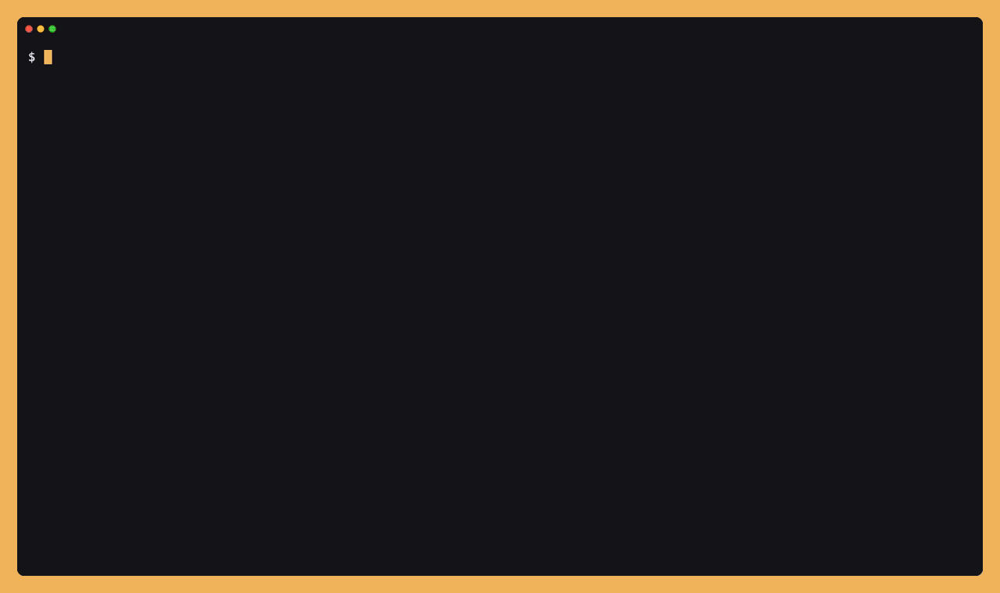
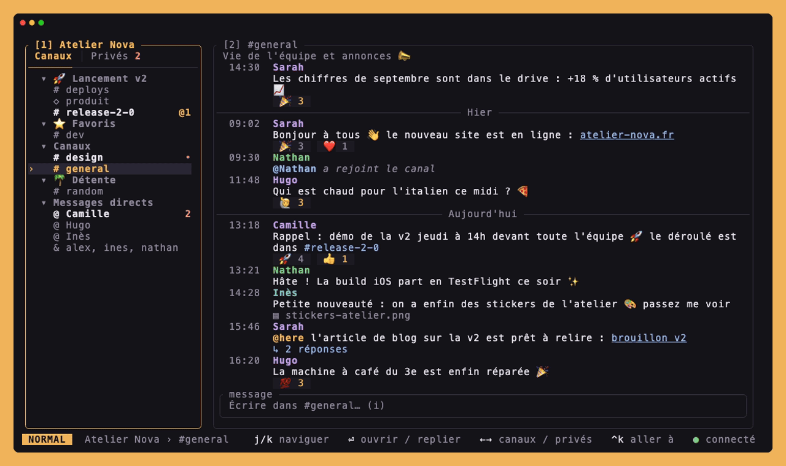
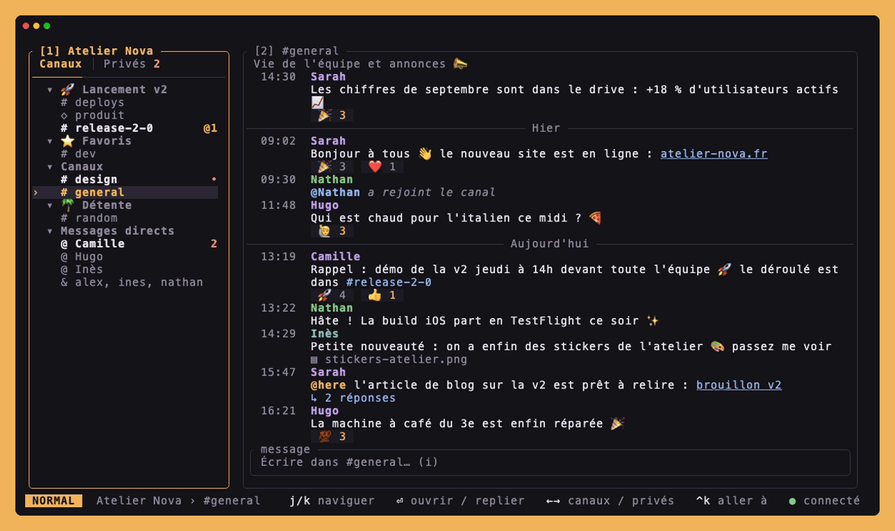
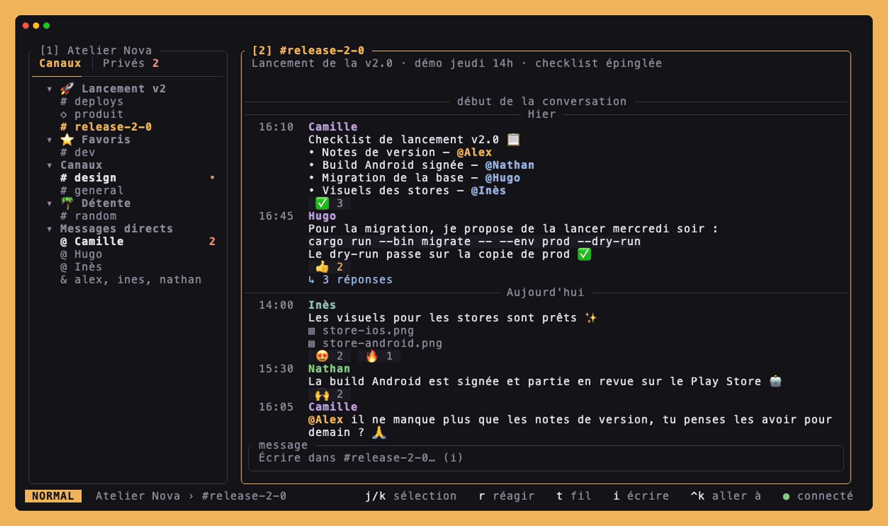
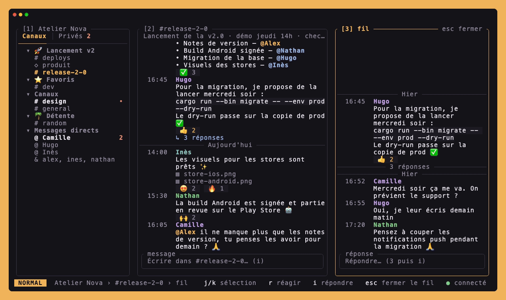
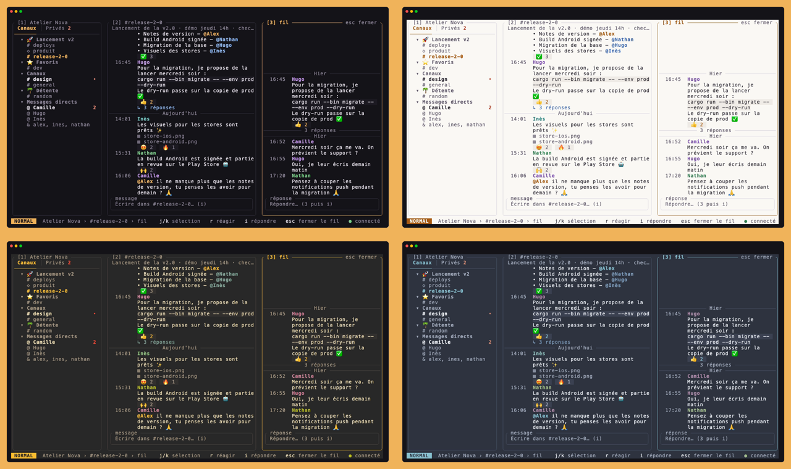

<div align="center">

# slackterm

**Slack, dans ton terminal.**

Temps réel, fils de discussion, recherche, sections : tout au clavier, sans quitter le shell.




<sub>Tout ce que tu vois ici tourne sur un workspace fictif : <code>slackterm demo</code>, sans compte Slack.</sub>

</div>

---

## Pourquoi

Slack dans le navigateur, c'est un onglet de plus, beaucoup de souris et pas mal de mémoire.
slackterm reprend ce qui compte au quotidien — lire, répondre, retrouver un message, savoir où on t'attend — dans une interface clavier légère, pensée pour vivre à côté de ton éditeur.

- ⚡ **Temps réel** : messages, modifications, suppressions et réactions arrivent en direct, avec reconnexion automatique.
- 🧵 **Fils de discussion** dans un panneau dédié, pour lire et répondre sans perdre le canal de vue.
- 🗂️ **Tes sections Slack** (avec leurs emoji), repliables, et un onglet **Privés** trié par activité.
- 🔎 **Recherche** dans tout l'historique, avec `in:#canal`, `from:@personne`, `during:today`…
- 🎯 **Ctrl+K** pour sauter n'importe où en quelques lettres (recherche floue).
- 🔔 **Non-lus et mentions** repris de ton client Slack au démarrage, puis tenus à jour.
- 🎨 **3 dispositions, 4 thèmes** et une couleur d'accent, changés en direct.
- 😄 **Réactions** en deux touches, et les emoji Slack (`:tada:`, tons de peau, drapeaux) convertis en vrais emoji.

## Essayer sans compte

Pas besoin de compte : le mode démo ouvre un faux workspace, avec une équipe qui prépare le lancement de la v2 de son app. Les messages arrivent tout seuls, et tes collègues réagissent à ce que tu écris.

```sh
git clone https://github.com/simoncdna/slackterm.git
cd slackterm
cargo run --release -- demo
```

Rien ne sort de la machine, et tes réglages ne sont ni lus ni modifiés.

---

## Tour d'horizon

### Naviguer comme dans Slack

La barre latérale reprend les sections que tu as rangées dans Slack. `Entrée` replie une section, mais les conversations qui t'attendent (non-lus, mentions) restent visibles. `←` / `→` bascule entre **Canaux** et **Privés**, où tes messages directs sont classés par activité récente. Et pour aller plus vite : `Ctrl+K`, trois lettres, `Entrée`.



### Chercher dans tout l'historique

`/` ouvre la recherche dans les messages de tout le workspace, avec les termes trouvés surlignés. Ouvrir un résultat t'emmène au message, en chargeant l'historique plus ancien si besoin ; si c'est une réponse, son fil s'ouvre à côté. Les filtres de Slack fonctionnent : `in:#dev`, `from:@hugo`, `during:today`, `"phrase exacte"`.



### Réagir sans lâcher le clavier

Sélectionne un message, `r` : les réactions les plus utilisées dans tes conversations sont proposées en premier, et quelques lettres suffisent pour trouver n'importe quel emoji, y compris ceux de ton workspace. Choisir une réaction que tu as déjà posée la retire.



### Trois dispositions, changées en direct

`,` ouvre les réglages : chaque changement s'applique immédiatement et est enregistré pour la prochaine fois.



| | Disposition | Pour qui |
|---|---|---|
| **A** | Trois panneaux : barre latérale, canal, fil | La plus proche de Slack, idéale en plein écran |
| **B** | Flux dense façon IRC, liste numérotée | Un max de messages à l'écran |
| **C** | Focus : le canal seul, on navigue avec `Ctrl+K` | Dans un split à côté de ton éditeur |

### Quatre thèmes

**Nuit**, **Clair**, **Gruvbox** et **Nord**, avec un accent au choix (ambre, bleu, lilas, vert). Chaque personne garde sa couleur d'un message à l'autre.



---

## Installation

Il faut [Rust](https://rustup.rs) 1.88 ou plus récent.

```sh
git clone https://github.com/simoncdna/slackterm.git
cd slackterm
cargo install --path .
```

## Connexion

```sh
slackterm login
```

slackterm ouvre Chrome (ou Chromium, Brave, Edge) dans un profil dédié : tu te connectes à ton workspace comme d'habitude, et il récupère la session web (token `xoxc` et cookie `d`). Rien à créer côté Slack, pas d'app à faire valider par un admin. Le profil est conservé, donc une session expirée se renouvelle en général d'un clic.

Les identifiants sont enregistrés dans le trousseau du système (Trousseau d'accès sur macOS), jamais en clair sur le disque.

```sh
slackterm              # ouvre l'interface
slackterm status       # vérifie que la session est toujours valide
slackterm logout       # efface les identifiants
```

| Option de `login` | |
|---|---|
| `--manual` | Coller toi-même le token et le cookie, copiés depuis les DevTools |
| `--browser <CHEMIN>` | Utiliser un autre navigateur basé sur Chromium |
| `--timeout <SECONDES>` | Temps laissé pour se connecter (300 par défaut) |

> [!NOTE]
> slackterm passe par la session du client web et quelques API non documentées (`client.counts`, `users.channelSections.list`), comme le fait l'app Slack elle-même. Vérifie que c'est compatible avec les règles de ton workspace.

---

## Raccourcis

La touche `,` affiche les réglages et la barre d'état rappelle toujours les raccourcis utiles là où tu es.

**Partout**

| Touche | Action |
|---|---|
| `Ctrl+K` | Aller à un canal ou une personne |
| `/` ou `Ctrl+F` | Chercher dans les messages |
| `,` | Réglages (disposition, thème, accent) |
| `Tab` / `Shift+Tab` | Panneau suivant / précédent |
| `1` `2` `3` | Barre latérale, messages, fil |
| `q` ou `Ctrl+C` | Quitter |

**Barre latérale**

| Touche | Action |
|---|---|
| `j` `k` ou `↓` `↑` | Se déplacer |
| `g` / `G` | Tout en haut / tout en bas |
| `h` `l`, `←` `→` ou `[` `]` | Onglet Canaux / Privés |
| `Entrée` ou `Espace` | Ouvrir la conversation, replier la section |

**Messages**

| Touche | Action |
|---|---|
| `j` `k` ou `↓` `↑` | Sélectionner un message (remonter au-delà du plus ancien charge la suite) |
| `PgUp` / `PgDn` | Page précédente / suivante |
| `g` / `G` | Premier message / revenir en bas |
| `t` | Ouvrir le fil du message |
| `r` | Réagir au message (aussi dans le fil) |
| `i`, `a` ou `Entrée` | Écrire |
| `Échap` | Désélectionner, fermer le fil |

**En écrivant**

| Touche | Action |
|---|---|
| `Entrée` | Envoyer |
| `Shift+Entrée`, `Alt+Entrée` ou `Ctrl+J` | Nouvelle ligne |
| `Ctrl+A` / `Ctrl+E` | Début / fin de ligne |
| `Ctrl+W` ou `Alt+⌫` | Effacer le mot précédent |
| `Ctrl+U` | Tout effacer |
| `Échap` | Revenir en mode normal |

## Configuration

Les réglages faits avec `,` sont enregistrés dans `config.toml` (`~/Library/Application Support/slackterm/` sur macOS, `~/.config/slackterm/` sur Linux). Tu peux aussi l'écrire à la main :

```toml
layout = "panels"   # panels | stream | focus
theme = "nuit"      # nuit | clair | gruvbox | nord
accent = "theme"    # theme | ambre | bleu | lilas | vert
```

Les sections repliées et l'onglet ouvert sont retenus à part, dans `sidebar.toml`.

---

## Sous le capot

- **Rust + [ratatui](https://ratatui.rs)**, runtime **tokio**.
- **Architecture à la Elm** : toute la logique passe par `update(app, event) -> Vec<Command>`, qui renvoie les effets à exécuter au lieu de les lancer. Elle se teste donc sans Slack, et le mode démo n'est qu'un autre exécuteur branché sur la même interface.
- **Temps réel** via le websocket de `rtm.connect`, avec ping et reconnexion à délai croissant.

```
src/
├── auth/        connexion par le navigateur (Chrome DevTools Protocol) ou à la main
├── slack/       client HTTP, websocket temps réel, mrkdwn, emoji
└── tui/
    ├── update/  toute la logique : touches, overlays, événements
    ├── ui/      dessin : trois dispositions, barre latérale, popups
    ├── demo/    le workspace fictif de `slackterm demo`
    └── executor.rs  exécute les commandes contre l'API Slack
```

### Refaire les vidéos

Les animations de ce README sont des scripts [VHS](https://github.com/charmbracelet/vhs) joués sur le mode démo : elles se régénèrent en une commande après chaque évolution de l'interface.

```sh
brew install vhs
docs/record.sh          # toutes les vidéos
docs/record.sh search   # seulement docs/tapes/search.tape
```
